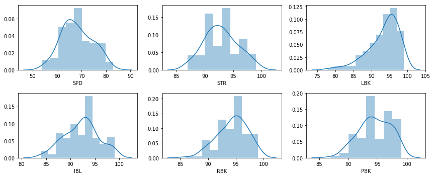
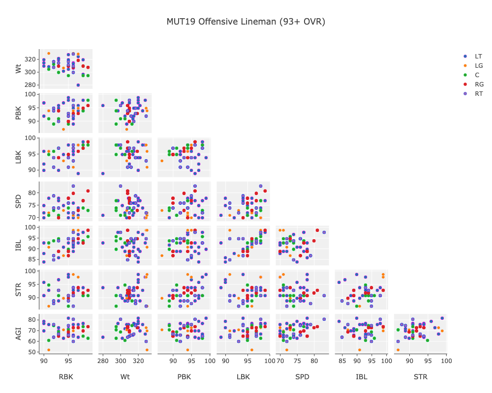
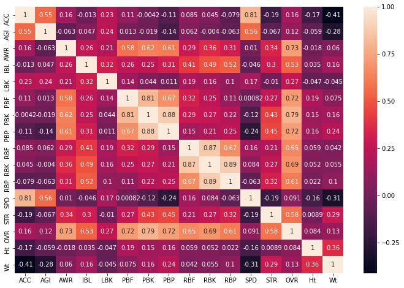

# MUT Scraper
### A short tutorial for using the MUTScraper module
#### Matt Johnson. January, 2019 (last updated July 5, 2019)

-------------

Scrape and save data from desired positions by inputing one of the following position options and a minimum overall to filter for.

Scraped data included player ratings and traits and is saved to a csv file.

Available Position Options:
- WR
- RB
- QB
- FB
- TE
- OL (LT, LG, C, RG, RT)
- DB (SS, FS, CB)
- LB (ROLB, MLB, LOLB)
- DL (RE, DT, LE)
- ST (K, P)


```
%matplotlib inline
import matplotlib.pyplot as plt
from MUTScraper import Player, PlayerHandler
%load_ext autoreload
%autoreload 2
import plotly as py
import plotly.plotly as py
import plotly.graph_objs as go
import pandas as pd
from ipywidgets import interactive, HBox, VBox, widgets, interact
import time
```


#### Input position, minimum overall, and date:

- Here we have chosen to look at Offensive Line (OL) players.
- Calling handle_players() starts the scraping process.


```
start = time.time()

ph = PlayerHandler(position='OL', min_ovr=93, date='july5')
ph.handle_players()

finish = time.time()

print(f'Time elapsed: {finish-start:.2f} sec')
```

    Number of pages: 6
    https://www.muthead.com/19/players?filter-market=3&filter-ovr-min=93&filter-position=992&page=1
     129 player links gathered.
    Time elapsed: 357.39 sec


### Data
We now have the ratings, attributes, and traits for the players.<br>
Here is the DataFrame holding the player data:


```
pdf = ph.player_df
pdf.head()
```


<div>
<table border="1" class="dataframe">
  <thead>
    <tr style="text-align: right;">
      <th></th>
      <th>ACC</th>
      <th>AGI</th>
      <th>AWR</th>
      <th>IBL</th>
      <th>LBK</th>
      <th>PBF</th>
      <th>PBK</th>
      <th>PBP</th>
      <th>RBF</th>
      <th>RBK</th>
      <th>...</th>
      <th>SPD</th>
      <th>STR</th>
      <th>High Motor</th>
      <th>Penalty</th>
      <th>HtWt</th>
      <th>OVR</th>
      <th>Position</th>
      <th>Team</th>
      <th>Ht</th>
      <th>Wt</th>
    </tr>
  </thead>
  <tbody>
    <tr>
      <th>Willie Anderson</th>
      <td>69</td>
      <td>57</td>
      <td>99</td>
      <td>99</td>
      <td>90</td>
      <td>97</td>
      <td>98</td>
      <td>99</td>
      <td>97</td>
      <td>98</td>
      <td>...</td>
      <td>59</td>
      <td>99</td>
      <td>Yes</td>
      <td>Norma</td>
      <td>Ht: 6' 5" Wt: 340</td>
      <td>99</td>
      <td>RT</td>
      <td>Cincinnati Bengals</td>
      <td>77</td>
      <td>340</td>
    </tr>
    <tr>
      <th>David Andrews</th>
      <td>89</td>
      <td>63</td>
      <td>99</td>
      <td>96</td>
      <td>98</td>
      <td>99</td>
      <td>98</td>
      <td>97</td>
      <td>99</td>
      <td>99</td>
      <td>...</td>
      <td>73</td>
      <td>91</td>
      <td>Yes</td>
      <td>Norma</td>
      <td>Ht: 6' 3" Wt: 295</td>
      <td>99</td>
      <td>C</td>
      <td>New England Patriots</td>
      <td>75</td>
      <td>295</td>
    </tr>
    <tr>
      <th>Steve Hutchinson</th>
      <td>80</td>
      <td>65</td>
      <td>99</td>
      <td>99</td>
      <td>98</td>
      <td>95</td>
      <td>97</td>
      <td>98</td>
      <td>96</td>
      <td>99</td>
      <td>...</td>
      <td>67</td>
      <td>97</td>
      <td>Yes</td>
      <td>Disciplined</td>
      <td>Ht: 6' 5" Wt: 313</td>
      <td>99</td>
      <td>LG</td>
      <td>Seattle Seahawks</td>
      <td>77</td>
      <td>313</td>
    </tr>
    <tr>
      <th>Chris Lindstrom</th>
      <td>89</td>
      <td>74</td>
      <td>99</td>
      <td>99</td>
      <td>99</td>
      <td>97</td>
      <td>96</td>
      <td>96</td>
      <td>99</td>
      <td>99</td>
      <td>...</td>
      <td>81</td>
      <td>93</td>
      <td>Yes</td>
      <td>Norma</td>
      <td>Ht: 6' 4" Wt: 308</td>
      <td>99</td>
      <td>RG</td>
      <td>Atlanta Falcons</td>
      <td>76</td>
      <td>308</td>
    </tr>
    <tr>
      <th>Kevin Mawae</th>
      <td>82</td>
      <td>68</td>
      <td>98</td>
      <td>94</td>
      <td>97</td>
      <td>99</td>
      <td>99</td>
      <td>98</td>
      <td>98</td>
      <td>96</td>
      <td>...</td>
      <td>69</td>
      <td>97</td>
      <td>Yes</td>
      <td>Norma</td>
      <td>Ht: 6' 4" Wt: 289</td>
      <td>99</td>
      <td>C</td>
      <td>New York Jets</td>
      <td>76</td>
      <td>289</td>
    </tr>
  </tbody>
</table>
<p>5 rows × 21 columns</p>
</div>


```
import seaborn as sns

plt.figure(figsize=(12,5))

attribs = ['SPD', 'STR', 'LBK', 'IBL', 'RBK', 'PBK']

for i in range(len(attribs)):
    plt.subplot(2, 3, i+1)
    sns.distplot(pdf[attribs[i]]);
plt.tight_layout();
```





#### Filtering data to fit our needs
- Lead the Way requires 90 LBK and is a must we filter for 89 as to keep players with Power-Ups in play (which would give them a +1). 
- Speed is important for pulling and getting blocks so we remove the slower players to clean up our visualization


```
def attribute_restriction(dat, attrib, rating):
    df = dat.copy()
    df = df[ df[attrib] >= rating]
    return df
```


```
pdf2 = attribute_restriction(pdf, 'LBK', 89)
pdf2 = attribute_restriction(pdf2, 'SPD', 70)
```

#### Grouping players by position:
- This is just for coloring in Plotly


```
ol_groups = pdf2.groupby('Position')

df_dict = {}

for name, group in ol_groups:
    df_dict.update({name: group})
```

### Visualization with Plotly 


```
positions = ['LT', 'LG', 'C', 'RG', 'RT']
attribs = ['RBK', 'Wt', 'PBK', 'LBK', 'SPD', 'IBL', 'STR', 'AGI']
color_map = {'LT': 'rgb(230,0,230)', 'LG': 'rgb(230,230,230)', 'C': 'rgb(20,230,100)', 
             'RG': 'rgb(240,5,30)', 'RT': 'rgb(0,50,240)'}

def get_trace(df, pos):
    trace = go.Splom(dimensions = [dict(label=attrib, values=df[attrib]) for attrib in attribs],
                text=df.index.values,
                name=pos,
                marker=dict(size=6,
                            showscale=False,
                            line=dict(width=0.5,
                                      color=color_map[pos])))
    trace['diagonal'].update(visible=False)
    trace['showupperhalf']=False
    return trace

    
traces = [get_trace(df_dict.get(pos), pos) for pos in positions]

axis = dict(showline=True,
          zeroline=False,
          gridcolor='#fff',
          ticklen=4)


layout = go.Layout(
    title='MUT19 Offensive Lineman (93+ OVR)',
    dragmode='select',
    width=1000,
    height=800,
    autosize=False,
    hovermode='closest',
    plot_bgcolor='rgba(240,240,240, 0.95)',
    xaxis1=dict(axis), xaxis2=dict(axis), xaxis3=dict(axis), xaxis4=dict(axis),
    xaxis5=dict(axis), xaxis6=dict(axis), xaxis7=dict(axis), xaxis8=dict(axis),
    yaxis1=dict(axis), yaxis2=dict(axis), yaxis3=dict(axis), yaxis4=dict(axis),
    yaxis5=dict(axis), yaxis6=dict(axis), yaxis7=dict(axis), yaxis8=dict(axis)
)

fig = dict(data=traces, layout=layout)

py.iplot(fig)
```




### Correlation between Variables:
We can see a correlation of -0.41 between Wt and Accel.


```
plt.subplots(figsize=(12,8))
sns.heatmap(pdf.corr(), annot=True);
```




