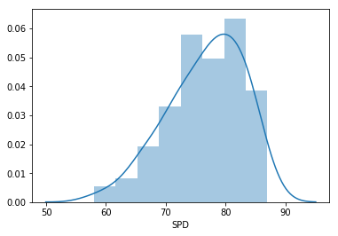
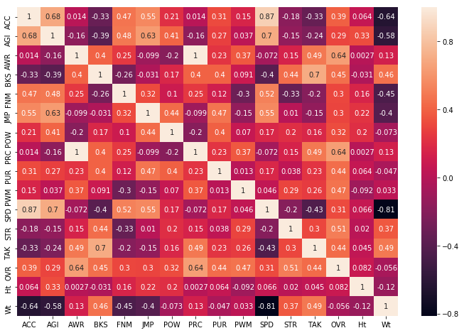

# MUT Scraper
### A short tutorial for the MUTScraper module
#### Matt Johnson Jan 20, 2019

-------------

Available Position Options:
- WR
- RB
- QB
- FB
- TE
- OL (LT, LG, C, RG, RT)
- DB (SS, FS, CB)
- LB (ROLB, MLB, LOLB)
- DL (RE, DT, LE)
- ST (K, P)


```python
# Import Libraries
%matplotlib inline
%load_ext autoreload
%autoreload 2
import pandas as pd
import matplotlib.pyplot as plt
import plotly as py
import plotly.plotly as py
import plotly.graph_objs as go
from ipywidgets import interactive, HBox, VBox, widgets, interact
from MUTScraper import Player, PlayerHandler
```

    The autoreload extension is already loaded. To reload it, use:
      %reload_ext autoreload


#### Input position, minimum overall, and date:
Click the link and get the number of pages (TODO: this is not great, fix).

Here we have chosen to look at Defensive Line (DL) players:


```python
ph = PlayerHandler(position='DL', min_ovr=90, date='jan20')
```

    Retrieve the number of pages...
    https://www.muthead.com/19/players?filter-market=3&filter-ovr-min=90&filter-position=7168&page=1


#### Start Scraping
Calling handle_players(pages=numberOfPages) starts the scraping process:


```python
ph.handle_players(pages=4)
```

     100 player links gathered.


#### Data
We now have the defensive attributes and traits for the players.<br>
Here is the DataFrame holding the player data:


```python
pdf = ph.player_df
pdf.head()
```


<div>
<style scoped>
    .dataframe tbody tr th:only-of-type {
        vertical-align: middle;
    }

    .dataframe tbody tr th {
        vertical-align: top;
    }

    .dataframe thead th {
        text-align: right;
    }
</style>
<table border="1" class="dataframe">
  <thead>
    <tr style="text-align: right;">
      <th></th>
      <th>ACC</th>
      <th>AGI</th>
      <th>AWR</th>
      <th>BKS</th>
      <th>FNM</th>
      <th>JMP</th>
      <th>POW</th>
      <th>PRC</th>
      <th>PUR</th>
      <th>PWM</th>
      <th>...</th>
      <th>DL Swim Move</th>
      <th>High Motor</th>
      <th>Penalty</th>
      <th>Strips Ball</th>
      <th>HtWt</th>
      <th>OVR</th>
      <th>Position</th>
      <th>Team</th>
      <th>Ht</th>
      <th>Wt</th>
    </tr>
  </thead>
  <tbody>
    <tr>
      <th>Myles Garrett</th>
      <td>92</td>
      <td>85</td>
      <td>91</td>
      <td>95</td>
      <td>85</td>
      <td>95</td>
      <td>92</td>
      <td>91</td>
      <td>98</td>
      <td>95</td>
      <td>...</td>
      <td>Yes</td>
      <td>No</td>
      <td>Undisciplined</td>
      <td>Yes</td>
      <td>Ht: 6' 4" Wt: 272</td>
      <td>97</td>
      <td>RE</td>
      <td>Cleveland Browns</td>
      <td>76</td>
      <td>272</td>
    </tr>
    <tr>
      <th>Damon Harrison Sr</th>
      <td>79</td>
      <td>68</td>
      <td>96</td>
      <td>97</td>
      <td>85</td>
      <td>75</td>
      <td>82</td>
      <td>96</td>
      <td>95</td>
      <td>91</td>
      <td>...</td>
      <td>Yes</td>
      <td>Yes</td>
      <td>Disciplined</td>
      <td>No</td>
      <td>Ht: 6' 3" Wt: 350</td>
      <td>96</td>
      <td>DT</td>
      <td>Detroit Lions</td>
      <td>75</td>
      <td>350</td>
    </tr>
    <tr>
      <th>Ed Too Tall Jones</th>
      <td>84</td>
      <td>78</td>
      <td>95</td>
      <td>96</td>
      <td>88</td>
      <td>87</td>
      <td>88</td>
      <td>95</td>
      <td>91</td>
      <td>94</td>
      <td>...</td>
      <td>No</td>
      <td>Yes</td>
      <td>Norma</td>
      <td>No</td>
      <td>Ht: 6' 9" Wt: 271</td>
      <td>96</td>
      <td>LE</td>
      <td>Dallas Cowboys</td>
      <td>81</td>
      <td>271</td>
    </tr>
    <tr>
      <th>Bruce Smith</th>
      <td>85</td>
      <td>75</td>
      <td>94</td>
      <td>90</td>
      <td>94</td>
      <td>79</td>
      <td>88</td>
      <td>94</td>
      <td>88</td>
      <td>96</td>
      <td>...</td>
      <td>Yes</td>
      <td>Yes</td>
      <td>Norma</td>
      <td>No</td>
      <td>Ht: 6' 4" Wt: 262</td>
      <td>96</td>
      <td>RE</td>
      <td>Buffalo Bills</td>
      <td>76</td>
      <td>262</td>
    </tr>
    <tr>
      <th>Geno Atkins</th>
      <td>84</td>
      <td>71</td>
      <td>96</td>
      <td>96</td>
      <td>86</td>
      <td>75</td>
      <td>72</td>
      <td>96</td>
      <td>91</td>
      <td>94</td>
      <td>...</td>
      <td>No</td>
      <td>Yes</td>
      <td>Disciplined</td>
      <td>Yes</td>
      <td>Ht: 6' 1" Wt: 300</td>
      <td>95</td>
      <td>DT</td>
      <td>Cincinnati Bengals</td>
      <td>73</td>
      <td>300</td>
    </tr>
  </tbody>
</table>
<p>5 rows × 26 columns</p>
</div>


#### Variables


```python
print(pdf.columns)
```

    Index([ACC, AGI, AWR, BKS, FNM, JMP, POW, PRC, PUR, PWM, SPD, STR, TAK,
           'Big Hitter', 'DL Bull Rush Move', 'DL Spin Move', 'DL Swim Move',
           'High Motor', 'Penalty', 'Strips Ball', 'HtWt', 'OVR', 'Position',
           'Team', 'Ht', 'Wt'],
          dtype='object')


```python
pdf.shape
```


    (100, 26)


```python
pdf.dtypes
```


    ACC                   int64
    AGI                   int64
    AWR                   int64
    BKS                   int64
    FNM                   int64
    JMP                   int64
    POW                   int64
    PRC                   int64
    PUR                   int64
    PWM                   int64
    SPD                   int64
    STR                   int64
    TAK                   int64
    Big Hitter           object
    DL Bull Rush Move    object
    DL Spin Move         object
    DL Swim Move         object
    High Motor           object
    Penalty              object
    Strips Ball          object
    HtWt                 object
    OVR                   int64
    Position             object
    Team                 object
    Ht                    int64
    Wt                    int64
    dtype: object


```python
import seaborn as sns

sns.distplot(pdf['SPD']);
```





```python
heavy = pdf[ pdf['Wt'] >= 300]
lighter = pdf[ pdf['Wt'] < 300]

fast = pdf[ pdf['SPD'] >= 80]
medium = pdf[ (pdf['SPD'] >= 70) & (pdf['SPD'] < 80)]
slow = pdf[ pdf['SPD'] < 70]
```

Grouping players by position:


```python
position_groups = pdf.groupby('Position')

df_dict = {}

for name, group in position_groups:
    df_dict.update({name: group})
```

Method for filtering dataframe by an attributes rating:


```python
def attribute_restriction(dat, attrib, rating):
    df = dat.copy()
    df = df[ df[attrib] >= rating]
    return df
```

### Visualization with Plotly 


```python
#pdf2 = attribute_restriction(pdf, 'AGI', 87)
#pdf2 = attribute_restriction(pdf2, 'SPD', 85)

#df = pdf

color_map = {'LE': 'rgb(230,0,230)', 'DT': 'rgb(230,230,230)', 'RE': 'rgb(240,5,30)'}

attrib_list = ['SPD', 'BKS', 'PWM', 'Wt', 'STR', 'FNM', 'TAK', 'Ht']

def get_trace(pos, df0):

    trace = go.Splom(dimensions=[dict(label=attrib, values=df0[attrib]) for attrib in attrib_list],
                text=df0.index.values,
                name=pos,
                marker=dict(size=5,
                            showscale=False,
                            line=dict(width=0.5,
                                      color=color_map.get(pos)))
                )
    return trace
```


```python
# Trace
traces = []

for pos in ['LE', 'DT', 'RE']:
    traces.append( get_trace(pos, df_dict.get(pos)))

# Axis
axis = dict(showline=True,
          zeroline=False,
          gridcolor='#fff',
          ticklen=4)

layout = go.Layout(
    title='MUT19 Defensive Lineman (90+ OVR)',
    dragmode='select',
    width=1000,
    height=800,
    autosize=False,
    hovermode='closest',
    plot_bgcolor='rgba(240,240,240, 0.95)',
    xaxis1=dict(axis), xaxis2=dict(axis), xaxis3=dict(axis), xaxis4=dict(axis),
    xaxis5=dict(axis), xaxis6=dict(axis), xaxis7=dict(axis), xaxis8=dict(axis),
    yaxis1=dict(axis), yaxis2=dict(axis), yaxis3=dict(axis), yaxis4=dict(axis),
    yaxis5=dict(axis), yaxis6=dict(axis), yaxis7=dict(axis), yaxis8=dict(axis)
)

for trace in traces:
    trace['diagonal'].update(visible=False)
    trace['showupperhalf']=False

fig = dict(data=traces, layout=layout)

py.iplot(fig)
```


<iframe id="igraph" scrolling="no" style="border:none;" seamless="seamless" src="https://plot.ly/~perronfrobenius/122.embed" height="800px" width="1000px"></iframe>


### Correlation between Variables:
We can see a correlation of 1 between PRC and AWR and -0.8 between SPD and Wt.


```python
plt.subplots(figsize=(12,8))
sns.heatmap(pdf.corr(), annot=True);
```




